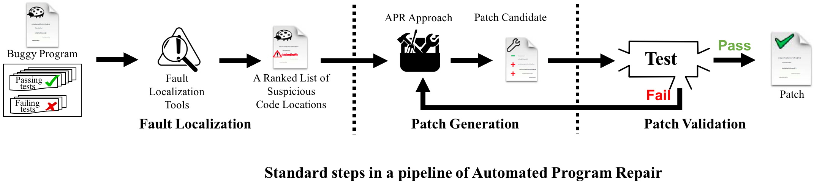
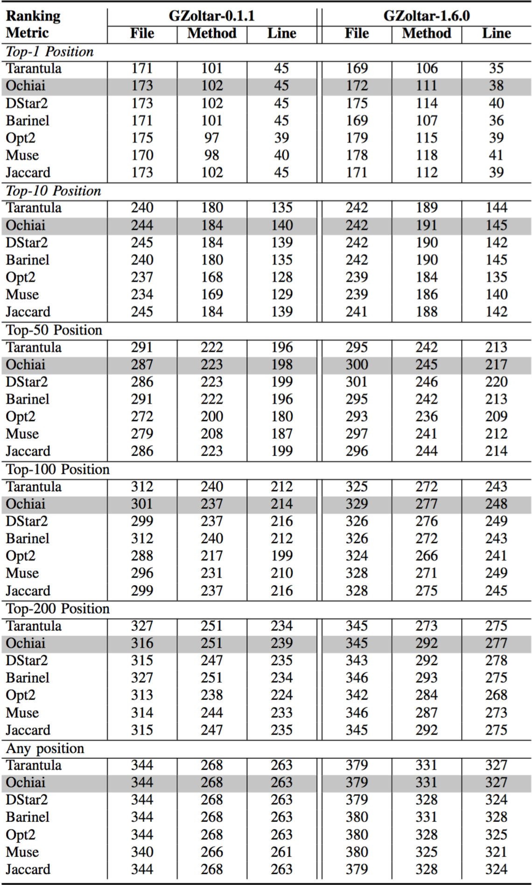

# FL-VS-APR
Fault Localization Bias in Benchmarking Automated Program Repair Systems

I. Requirement
--------------
 - Java 1.7
 - [Defects4J](https://github.com/rjust/defects4j)
 - GZoltar 0.1.1/1.6.0
 
 
II. Automated Program Repair (APR) Pipeline
-------------------------------------------
Most of recent APR systems follow the same basic pipeline as shown in the figure below: (1) localize the fault, (2) generate a candidate patch, and (3) validate the patch.
The first step (fault localization) of an APR system identifies an  entity in a program as the potential fault location.
In the second step (patch generation), given a fault location, the APR system modifies the program, i.e., creates a patch. The last step (patch validation) assesses whether the patch actually fixes the defect.
If the patch is not regarded as a valid patch, the second and last steps are repeated until a valid patch is generated or the termination condition is satisfied. 
To increase the chances of finding a valid patch, the process is iterated over all suspicious code locations ranked by FL tools.

 
III. Fault Localization (FL) in APR
-----------------------------------
In APR systems, fault localization (FL) is not only the first step but also seriously affects the performance of the systems. 
Given a buggy program (with its passing and failing test cases), an FL tool is leveraged during the FL step to identify the suspicious buggy code locations.
The [granularity](https://github.com/flvsapr/FL-VS-APR/blob/master/FL/GZoltar-0.1.1/README.md#granularity-fl) of suspicious locations can be a file, method, or line. Ideally, the location should be both precise and accurate.
If the precision is low (e.g., the granularity is broad such as file), the patch generation step needs to explore a large space of candidate patches.
If the accuracy is low (e.g., the FL step provides a wrong fault location), the subsequent step generates patches for the non-faulty program entity.

Spectrum-based fault localization (SBFL, also referred to as coverage-based fault localization) is one of the most popular FL techniques used in APR systems. This technique
applies a ranking metric to detect faulty code locations by leveraging the execution traces of test cases to calculate the likelihood (based on *suspiciousness scores*) of program entities to be faulty. 
The ranking metric is applied to calculate suspiciousness scores for program entities (such as program statements as well as code lines).

### Localizability of Defects4J Bugs

The below table provides quantitative details on the localizability of bugs at different levels of fault locality granularity (i.e., file, method and line). Experiments are performed with two distinct versions (0.1.1 and 1.6.0) of GZoltar and the different ranking metrics.

IV. Integration of FL Tools in APR Systems
------------------------------------------
The blow table lists the fault localization techniques integrated into state-of-the-art APR tools

| **APR tool**       | **FL testing framework**  | **Framework version**   | **FL ranking metric**     | **Granularity of fault locality** |     **Supplementary information**     |
| ---------- |:----------:|:---------:|:----------:|:--------------:|:-----------------------------:|
| **jGenProg**   |   GZoltar  |   0.1.1   |   Ochiai   |      line      |                 ∅                 |
| **jKali**      |   GZoltar  |   0.1.1   |   Ochiai   |      line      |                 ∅                 |
| **jMutRepair** |   GZoltar  |   0.1.1   |   Ochiai   |      line      |                 ∅                 |
| **HDRepair**   |     --     |     -     |     -      |      line      |       Fault method is known       |
| **Nopol**      |   GZoltar  |   0.0.10  |   Ochiai   |      line      |                 ∅                 |
| **ACS**        |   GZoltar  |   0.1.1   |   Ochiai   |      line      |         Predicate switching       |
| **ELIXIR**     |     --     |     -     |   Ochiai   |      line      |                 ∅                 |
| **JAID**       |     --     |     -     |      -     |      line      |                 ∅                 |
| **ssFix**      |   GZoltar  |   0.1.1   |      -     |      line      | Statements in crashed stack trace |
| **CapGen**     |   GZoltar  |   0.1.1   |   Ochiai   |      line      |                 ∅                 |
| **SketchFix**  |     --     |     -     |   Ochiai   |      line      |                 ∅                 |
| **FixMiner**   |   GZoltar  |   0.1.1   |   Ochiai   |      line      |                 ∅                 |
| **LSRepair**   |   GZoltar  |   0.1.1   |   Ochiai   |     Method     |                 ∅                 |
| **SimFix**     |   GZoltar  |   1.6.0   |   Ochiai   |      line      |      Test case purification       |

V. kPAR
-------

The blow table lists the number of bugs fixed by kPAR.

| **FL configuration**  | **Chart (C)** | **Closure (Cl)** | **Lang (L)** | **Math (M)** | **Mockito (Moc)** | **Time (T)** | **Total** |
| ----------------- |:---------:|:------------:|:--------:|:--------:|:-------------:|:--------:|:-----:|
| *Normal_FL*         |    3/10   |      5/9     |    1/8   |   7/18   |       1/2     |    1/2   | 18/49 |
| *File_Assumption*   |    4/7    |      6/13    |    1/8   |   7/15   |       2/2     |    2/3   | 22/48 |
| *Method_Assumption* |    4/6    |      7/16    |    1/7   |   7/15   |       2/2     |    2/3   | 23/49 |
| *Line_Assumption*   |    7/8    |     11/16    |    4/9   |   9/16   |       2/2     |    3/4   | 36/55 |

The following figure shows the bugs correctly fixed by kPAR with four FL configurations.

